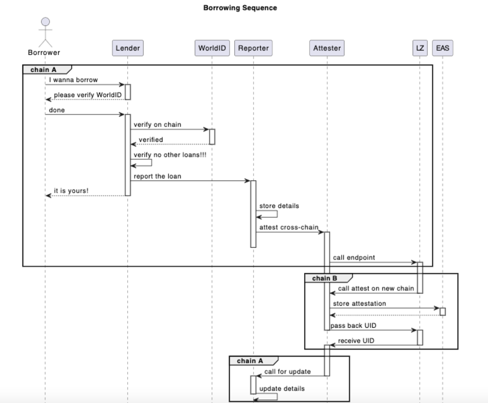

# OmniChain Loan Attester

Innovative omnichain loan reporting and attesting service. It leverages proof of humanity and attestations for uncollateralized lenders to solve multi-lending problem in this open world of blockchain.

## Contents

- [About](#About)
- [Deployments](#Deployments)
- [Tech Design](#tech-design)

## About

Uncollateralized lending is a growing narrative in crypto. This project aims to be a fully cross-chain solution and solve at least 2 problems:

- To find out if the user already has a loan on another blockchain or with another wallet.
- Allow lender to give loan on one chain but attest it on another chain ( where EAS works).
  At the same time, smart contracts and the application are designed in a way to protect lenders from users manipulating verification results before receiving a loan.
  Diagrams showing how the app works will be on github repo.

## Deployments

| Network         | OmnichainLoanAttester                      | UncollateralizedLenderSample               |
| --------------- | ------------------------------------------ | ------------------------------------------ |
| Optimism        | 0x627dA616cBCFDa74ea6263d6E8e9549a79243123 | 0x1D40D3CCc8747339A7909e7661Be36F2385F1E55 |
| Optimism Goerli | 0x9b34a8B1Ad8dBbf565C15A881a38dF0Fd542AcCF | 0xD99a95F81e2eeAd31C14099Cd23288153c4A1bF8 |
| Mode Sepolia    | 0x5db6384f8bDABC36fe6f00Ac375E2c07D0d2456c | 0xcCe3E0BAeFb57e96B6a61aCd5119BdF5C0452178 |
| Zora Testnet    | 0xcCe3E0BAeFb57e96B6a61aCd5119BdF5C0452178 | 0x645eaefA3dfE93b6140e4AB68113f56Fb1910Ca8 |
| Base Testnet    | 0xC42e8977Ea5d89b58FEea41a06b36b464B336305 | 0xf5a34f0Ad2edd6c8Dedd8B2bc0e1caC86531Fea3 |

## Tech Design



## Requirements

Before you begin, you need to install the following tools:

- [Node (v18 LTS)](https://nodejs.org/en/download/)
- Yarn ([v1](https://classic.yarnpkg.com/en/docs/install/) or [v2+](https://yarnpkg.com/getting-started/install))
- [Git](https://git-scm.com/downloads)

## Run

1. install dependencies

```
yarn install
```

2. Fill in .env.local in `packages/nextjs` folder

3. Run app locally.

```
yarn start
```

Visit your app on: `http://localhost:3000`. You can interact with your smart contract using the contract component or the example ui in the frontend. You can tweak the app config (and network) in `packages/nextjs/scaffold.config.ts`.
